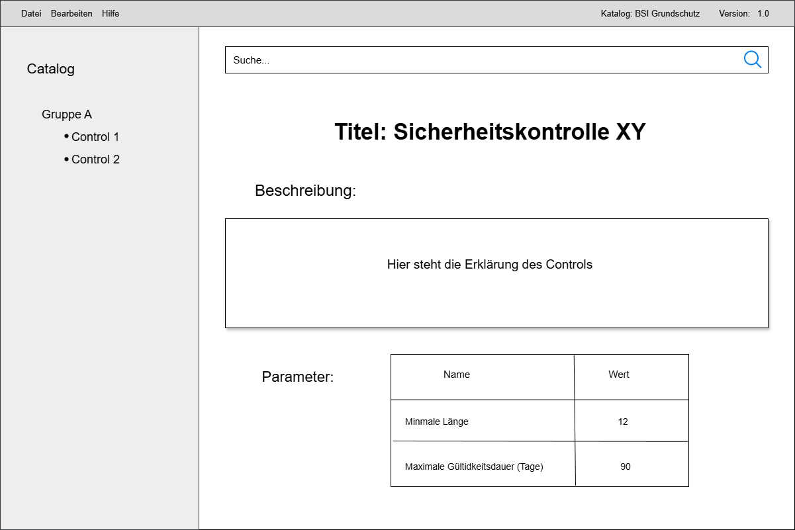
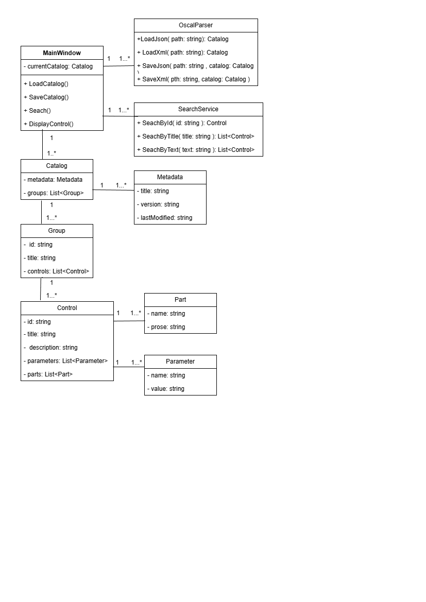

# OSCAL Desktop Anwendung

## Beschreibung
Diese Anwendung dient zur Bearbeitung von OSCAL-Katalogen im JSON- und XML-Format.

## Funktionen
- Katalog laden (JSON/XML)
- Anzeige von Gruppen und Controls
- Suche nach IDs, Titeln und Texten
- Bearbeitung von Metadaten
- Export als JSON/XML

## Mockup

## UML Diagramm

